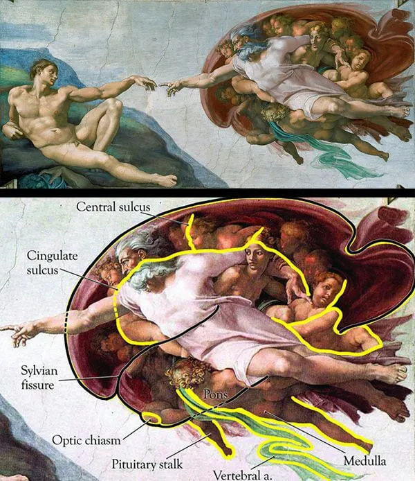
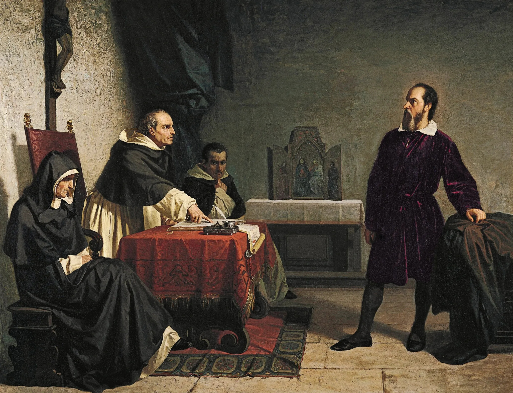
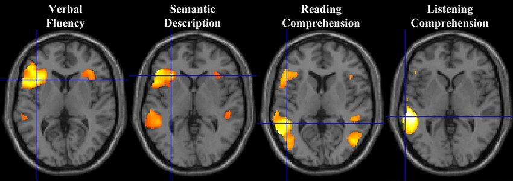

European civilization’s intellectual, political, and material progress has always depended on the integration of its philosophical thought with its fundamental science; its mathematical, physical, and biological understanding of reality. When these two domains are unified, Europe thrives. When they are in schism, with philosophy detached from its empirical anchor, Europe falters and declines.

This recurring pattern of synthesis and divergence can be traced through four distinct phases of Western history.

## I. The Classical Integration

_c. 600 BC – c. 529 AD_

In the classical world, no meaningful distinction existed between the philosopher and the scientist. They were unified in the pursuit of _logos_ (reason) and _kosmos_ (order). To be a "thinker" was, by definition, to be an investigator of reality at its most fundamental level. This synergy created a civilization that produced foundational insights in mathematics, politics, and ethics.

### Plato and the Academy (c. 428–348 BC)

The philosopher Plato provides a key example. His Academy in Athens, the model for all future European universities, was built on this integration. The inscription at its entrance, though possibly legendary, captures this spirit perfectly:[^1]

> "Let no one ignorant of geometry enter here."

Plato’s "Theory of Forms" argues that the physical world is a mere shadow of a perfect, eternal world of "Forms." The only way to perceive this true reality was through pure reason, and the highest, most rigorous form of this reason was **mathematics**. For Plato, geometry was the key to unlocking a higher understanding of existence itself.

### Aristotle, the Philosopher-Scientist (c. 384–322 BC)

Aristotle was the ultimate philosopher-scientist. His works were not just "philosophy" as we know it; they were the foundational texts for:[^2]

- Physics (_Physics_)
- Biology (_History of Animals_)
- Formal Logic (_Prior Analytics_)
- Metaphysics (_Metaphysics_)

For Aristotle, one could not understand ethics or politics without first understanding the _nature_ of the world (physics) and the _nature_ of man (biology, logic). He famously said:

> "In all things of nature there is something of the marvelous."

This holistic approach, where science informed philosophy and vice versa, was the engine of classical progress.

## II. The First Schism: Theological Subordination

_c. 529 AD – c. 1500 AD_

The classical integration was deliberately fractured. The primary goal of European thought shifted from **understanding the world** to **justifying God’s plan**. This period began symbolically with the closing of Plato's Academy in 529 AD by Emperor Justinian I, an act that formally subjugated classical inquiry to Christian doctrine.[^3]

### The Rise of Theocentrism

With the fall of the Western Roman Empire, the Church became the singular, unifying political and intellectual power in Europe. This power was maintained by replacing the classical focus on _logos_ (rational inquiry) with a focus on _theos_ (God).

Truth was no longer discovered; it was **revealed** through scripture and interpreted by the Church hierarchy. Philosophy's new role, as articulated by thinkers like Thomas Aquinas, was to be the "handmaiden of theology." Its purpose was solely to explain and defend religious doctrine.[^4]

### The Suppression of Scientific Inquiry

The schism did not just halt progress; it actively suppressed it. Science was forced underground, often associated with heresy.

Leonardo da Vinci (1452-1519) had to conduct his revolutionary anatomical studies by dissecting human corpses in secret, directly defying Church law, to advance modern medicine. His work was, by necessity, hidden.[^5]

> "Nature is the source of all true knowledge. She has her own logic, her own laws, she has no effect without cause nor invention without necessity." - Leonardo da Vinci

Decades later, it is widely theorized that Michelangelo (1475-1564) embedded a subversively scientific message in his most famous work. In "The Creation of Adam" on the Sistine Chapel ceiling, the shroud surrounding God forms a perfect, anatomically correct diagram of the human brain. This is interpreted as a hidden assertion that divine power is a product of **human intellect**—a dangerous, heretical idea that placed reason on par with God, hidden in plain sight from the Pope.[^6]

### The Punishment of Truth: Galileo's Trial

When this hidden science finally became too bold to ignore, suppression turned to punishment. The Trial of Galileo in 1633 is the definitive example.[^7]

Galileo used a telescope to gather empirical data, such as the phases of Venus and the moons of Jupiter, which proved the Heliocentric (sun-centered) model. The Church establishment, whose political and philosophical authority was tied to the Geocentric (Earth-centered) model, declared this a heresy. Galileo was forced to recant.

Theologians, in their role as thinkers, used their power to suppress the fundamental scientist. This act demonstrates the schism perfectly: critical thought based on evidence was subordinated to power based on dogma.

## III. The Reunion: The Enlightenment

_c. 1687 – c. 1800_

The first schism was dismantled by a powerful reintegration, with fundamental science providing the very tools philosophers needed to break free from dogma.

### Newton's "Clockwork Universe"

The catalyst for this reunion was Isaac Newton’s _Philosophiæ Naturalis Principia Mathematica_ (1687). In this work, Newton proved that the entire cosmos, from a falling apple to the orbits of planets, was governed by **discoverable, rational, mathematical laws**.[^8] This effectively "killed" the medieval God of daily miracles and replaced him with a "Clockmaker God" who created the system and let it run. This opened the door for human reason to become the primary authority.

> "I frame no hypotheses; for whatever is not deduced from the phenomena is to be called an hypothesis; and hypotheses, whether metaphysical or physical, whether of occult qualities or mechanical, have no place in experimental philosophy." - Isaac Newton

### The Enthronement of Reason

Enlightenment Philosophers used Newton's scientific certainty as a weapon against the "superstition" and "irrationality" of the Church and monarchy. In France, Diderot’s _Encyclopédie_ (1751–1772) was the practical application: an attempt to catalog all human knowledge based on **reason and science**.[^9] This movement led directly to the **French Revolution** and the concept of _laïcité_ (secularism).

This was not an isolated French phenomenon. In the **Scottish Enlightenment**, thinkers like Adam Smith (_The Wealth of Nations_) attempted to create a "science" of economics based on natural laws.[^10] In **Prussia**, Immanuel Kant defined the movement with the motto _Sapere aude_ ("Dare to know"), casting the use of one's own reason as a moral imperative.[^11]

> "The death of dogma is the birth of morality." – Immanuel Kant

## IV. The Second Schism: Ideological Subordination

_c. 1900 – Present_

The 20th and 21st centuries are defined by a new schism. The complexity of fields like quantum physics and molecular biology has been used to justify a detachment of social and political philosophy from fundamental science.

This schism subordinates empirical reality not to theology, but to **political and social ideologies**, leading to nonsensical positions, performative governance, and a loss of strategic autonomy.

### Case Study 1: Agriculture and GMOs

The first example is found in agriculture, specifically the EU's policy on GMOs. The ideological position is a widespread European ideology, formalized in the "precautionary principle," that views "naturalness" as an intrinsic good. This philosophy, promoted by powerful political and NGO groups, casts genetic modification (GMO) as an "unnatural" and hubristic act, regardless of scientific data.[^12]

On the other hand, the fundamental science of biology and environmental science shows that genetic modification (e.g., CRISPR) is a precise tool for achieving a result, like pest resistance, that humans have been doing clumsily for millennia via "natural" cross-breeding. Genetically modified crops are a proven tool for achieving stated European goals. They can be engineered to drastically reduce the need for pesticides, resist drought, and increase yields.

The irrational outcome of this ideological stance is the EU’s de facto ban on the cultivation of most GM crops. This political decision has stifled innovation, caused brain drain, and prevented pesticide reductions. It is a clear case of a social philosophy ("naturalness") winning out over the fundamental science of biology, to the detriment of the environment and economy.[^13]

### Case Study 2: Education and the Reading Wars

A second example can be seen in education, with the "whole language" debate. The ideological position was a dominant 20th-century educational philosophy, especially strong in France (_la méthode globale_) and the UK. It argued that learning to read is a "natural" process, like learning to speak. It claimed that explicit **phonics** (sounding out letters) was "authoritarian" and would kill a child's "love of reading." This was a social-political theory about child liberation.

However, the fundamental science of cognitive neuroscience and fMRI scanning shows that the human brain is **not** wired to read. Speaking is innate; reading is a learned skill that requires retraining parts of the brain. Brain imaging proves that reading requires the brain to build a new pathway to decode letters into sounds. "Whole language" (guessing from pictures) activates the wrong part of the brain. **Explicit phonics** is the only method that reliably builds the correct neural architecture.[^14]

The irrational outcome was that generations of children were passed through school without being given the fundamental tools to read, contributing to a literacy crisis where **one in five Europeans is functionally illiterate**.[^15] This was a direct result of educational "thinkers" allowing their social ideology to overrule the hard evidence from neuroscience.

### Case Study 3: Energy and the _Energiewende_

The third example is Germany's energy policy, the _Energiewende_. The ideological position, core to the German Green Party, holds that nuclear power is categorically evil and an unacceptable risk. This position of social values predates the climate change debate.

This ideology clashes with the fundamental science of physics and engineering. Physics shows that the primary driver of climate change is **CO2**, and the most efficient, reliable, and high-density way to produce zero-carbon electricity is **nuclear fission**. Furthermore, engineering and grid science show that a modern grid requires a stable, 24/7 "baseload" power source. Wind and solar are intermittent and, without mass-scale battery technology, cannot provide this baseload.

|                 | Fuel Energy Density (GJ/kg) | Lifetime CO₂ Emissions (g CO₂eq/kWh) |
| :-------------- | :-------------------------- | :----------------------------------- |
| **Nuclear**     | ~3,500                      | ~12                                  |
| **Natural Gas** | ~0.05                       | ~490                                 |
| **Oil**         | ~0.042                      | ~733                                 |
| **Coal**        | ~0.03                       | ~820                                 |
| **Hydropower**  | N/A (Flow)                  | ~24                                  |

The irrational outcome of this ideology was the decision to shut down Germany’s zero-carbon nuclear plants before a renewable replacement was scientifically viable. This forced a return to the only available baseload alternative: **lignite coal**, the single most CO2-polluting fossil fuel. The thinkers, in pursuit of their social goal, directly contradicted their stated goal of saving the climate by ignoring the fundamental science of physics.[^16]

## V. A New Synthesis : Hyper Anabasis

The evidence suggests a recurring pattern in European intellectual history: a flourishing of progress during periods of synthesis between the philosophical and the scientific, and a subsequent decline when they diverge. The parallels between the First Schism of the medieval era and the Second Schism of the modern age are worthy of serious consideration.

This historical framework compels us to ask a critical question: are our current crises, be they environmental, political, or educational, the inevitable result of a philosophy detached from empiricism?

If so, the path forward is not to repeat the past, but to begin a philosophical successor to the Enlightenment. I call this movement **Hyper Anabasis**[^17]: a "great ascent" beyond our present limitations, dedicated to permanently reuniting our governing philosophies with the sciences.

The most practical step towards this new era is a profound and sustained investment in scientific literacy at every level of society. From primary school curricula to the continuing education of public servants, we must cultivate a culture of critical thinking and empirical curiosity. Only a population that values evidence can produce policy that does the same.

**We must place fundamental science back to its rightful position: the foundation upon which our philosophies, policies, and societies are built.**

[^1]: While the inscription is widely cited, its historical accuracy is debated. The earliest mentions appear centuries after Plato’s death. [University of St Andrews, School of Mathematics and Statistics](https://mathshistory.st-andrews.ac.uk/Biographies/Plato/)

[^2]: See Aristotle’s collected works, available online through [The Internet Classics Archive by MIT](http://classics.mit.edu/Aristotle/physics.html).

[^3]: The closing of the Academy is a significant marker. See [Struck, P. T. (2014). _The Closing of the Neoplatonic Academy at Athens_. Oxford Handbooks Online.](https://www.oxfordhandbooks.com/view/10.1093/oxfordhb/9780199935321.001.0001/oxfordhb-9780199935321-e-56)

[^4]: The concept of philosophy as the "handmaiden of theology" (ancilla theologiae) was a guiding principle for many medieval thinkers, most famously Thomas Aquinas. [Boston University, "Ancilla Theologiae"](https://faculty.fordham.edu/klima/ancilla.htm)

[^5]: Leonardo’s anatomical studies were extensive and often conducted in secret due to societal and religious proscriptions. ["Leonardo da Vinci: the mechanics of man", Royal Collection Trust](https://www.rct.uk/collection/publications/leonardo-da-vinci-the-mechanics-of-man).

[^6]: This interpretation was famously proposed by Dr. Frank Lynn Meshberger in the Journal of the American Medical Association. [Meshberger, F. L. (1990). "An interpretation of Michelangelo’s Creation of Adam based on neuroanatomy". JAMA, 264(14), 1837-1841.](https://www.semanticscholar.org/paper/An-interpretation-of-Michelangelo%27s-Creation-of-on-Meshberger/4200f3a2c8b63940469bd5a408911bc9178afdf5)

[^7]: The "Galileo Affair" is a well-documented historical event. For a summary of primary sources, see ["Famous Trials" by Professor Douglas O. Linder](https://famous-trials.com/galileotrial/1014-home).

[^8]: Isaac Newton’s **Philosophiæ Naturalis Principia Mathematica** (1687) is a cornerstone of modern science. A digitized version is available at the [Cambridge University Library](https://cudl.lib.cam.ac.uk/view/PR-ADV-B-00039-00001/1).

[^9]: Diderot’s **Encyclopédie, ou dictionnaire raisonné des sciences, des arts et des métiers** (1751-1772) was a seminal work of the Enlightenment. See the online version hosted by the [Bibliothèque Nationale de France](https://gallica.bnf.fr/ark:/12148/bpt6k50534p/f2.item.r=encyclopedie.langEN).

[^10]: Adam Smith’s **An Inquiry into the Nature and Causes of the Wealth of Nations** (1776) is a foundational text in classical economics. See the version at the [Online Library of Liberty](https://www.econlib.org/library/Smith/smWN.html).

[^11]: The phrase "Sapere aude" ("Dare to know") was used by Immanuel Kant in his 1784 essay ["Answering the Question: What Is Enlightenment?"](https://en.wikipedia.org/wiki/What_Is_Enlightenment%3F).

[^12]: The EU’s policy on GMOs is guided by the precautionary principle. See the [EU’s official page on the topic](https://www.efsa.europa.eu/en/topics/topic/gmo).

[^13]: For a deeper dive into the topic: [Are GMOs Good or Bad? Genetic Engineering & Our Food, Kurzgesagt – In a Nutshell](https://www.youtube.com/watch?v=7TmcXYp8xu4)

[^14]: [Stanford study on brain waves shows how different teaching methods affect reading development](https://news.stanford.edu/stories/2015/05/stanford-study-on-brain-waves-shows-how-different-teaching-methods-affect-reading-development); [Hemispheric specialization for visual words is shaped by attention to sublexical units during initial learning](https://www.sciencedirect.com/science/article/pii/S0093934X15000772).

[^15]: Adult skills in literacy and numeracy declining or stagnating in most OECD countries [OECD](https://www.oecd.org/en/about/news/press-releases/2024/12/adult-skills-in-literacy-and-numeracy-declining-or-stagnating-in-most-oecd-countries.html)

[^16]: Germany’s **Energiewende** has led to a paradoxical increase in coal use. For a comparison of CO2 intensity, looking at 5y historical data, Germany has emitted 14.9x more CO₂ than France. [Germany (283g CO₂eq/kWh)](https://app.electricitymaps.com/map/zone/FR/5y/monthly), [France (19g CO₂eq/kWh)](https://app.electricitymaps.com/map/zone/FR/5y/monthly).

[^17]: "Anabasis" is a Greek term meaning "a journey upward." "Hyper Anabasis" suggests a great ascent beyond current limitations.
